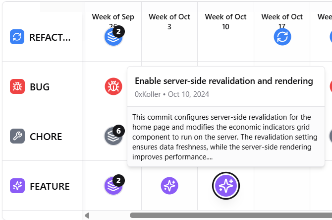

<div align="center">
  
# 📅 Chronocode 
An intelligent GitHub repo analyzer that summarizes and categorizes commits using Gemini, GitHub API, and Supabase. This iteration is implemented in golang with worker pools for commit downloading, concurrent AI processing and database pushing. 

This is a port of a project made for the [ShipBA Hackaton 2025](https://www.shipba.dev/) with [Octavio Pavón](https://x.com/octaviopvn1) and [Tiago Prelato](https://x.com/SneyX_). Originally made with Python and Lovable.
</div>

## Frontend example


## ENV file setup
```env
POSTGRES_USER=
POSTGRES_PASSWORD=$
POSTGRES_DB=
GEMINI_API_KEY=
GITHUB_CLIENT_ID=
GITHUB_CLIENT_SECRET=
REDIRECT_URL=http://localhost:8080/auth/github/callback
```

## Run
```bash
./rebuild.sh
```

