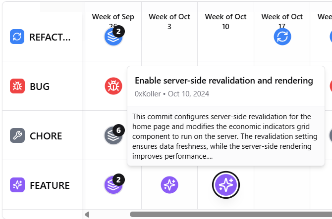

<div align="center">
  
# 📅 Chronocode 
An intelligent GitHub repo analyzer that summarizes and categorizes commits using Gemini, GitHub API, and Supabase. This iteration is implemented in golang with worker pools for commit downloading, concurrent AI processing and database pushing.
</div>

## Frontend example


## ENV file setup
```env
GEMINI_API_KEY=
SUPABASE_URL=
SUPABASE_KEY=
```

## Dependency installation
```bash
go mod tidy
```

## Run server
```bash
go run cmd/chronocode/server.go
```

## Example

```
http://localhost:8080/analyze-repository?repo_url=https://github.com/octokerbs/50Cent-Dolar-Blue-Bot&access_token=YourGithubApiToken
```

## Notes
- Google gives free gemini api keys for testing here [Google AI Studio](https://aistudio.google.com/app/apikey).
- The performance directory is just for testing the speed of the workers pool.
- The frontend is not currently available. 
- We use supabase to store commits and not re-analyze them when a repo is asked to again.
